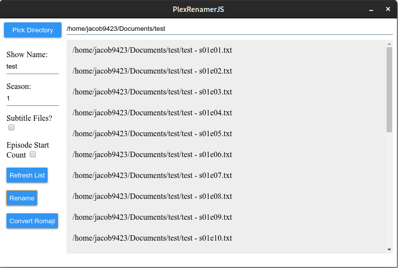

# PlexRenamer Electron Version
Plex renamer is now on Electron. Completly changing the language from C# To JavaScript. The benefit of this being that the program now works on Windows and Linux (Currently only building for linux. But it will work for windows if electron-builder is configured to build for windows). This will be in it's own repo as it is rewritten in a new language. The C# Version can be found [here](https://github.com/jacob9423/Plex-Renamer). But it won't be updated anymore.

-------------------------

A program that will take a directory of video files and then name them in the format that Plex wants for files.

This is my project to rename video files (and subtitle files) into plex format.

I was getting tired of renaming all of the files tha I was putting on my plex server. Renaming 20 50 or even 100 files isn't fun.

So started this project and it's come a long way. 

The program will let you select the directory that the files are in. Have you type in the name of the show, and allow you to select if they are subtitle files. Also the Check button only takes the files that are in the directory and display them to you. I did this for
testing but kept it in.

**Formating Examples:**

Videos:

Example - s01e01.mp4

Subtitles:

Example - s01e01.eng.ass

When renaming subtitle files eng is the default language so if you type nothing into it it will automaticly default to english.

**Convert Romanji:**  
The Convert Romanji feature if for anime only. It uses the [Anilist API](https://github.com/AniList/ApiV2-GraphQL-Docs) to search the Romanji name (or Native Japanese) and converts that to english. If there is no english name it will keep the orginal.  

# Screenshot
(Screenshot shows text files. Those are just my test files. It keeps whatever ext the file has.)

# Building
  
To build this applicaiton you need electron-builder and Node vesrion 12. Make sure to install the dependencies for the project with `npm install`
  
To install electron-builder use the command `npm install -g electron-builder` After electron builder is install open your terminal in the main diectory of PlexrenamerJS and run `electron-builder` and it will create binarys for Arch and Debian.
  
To package for windows use the command `electron-builder --win` and it will create a unpacked and installer for the program. (Note will need windows to do this. If on  linux building it for windows you will need wine.)

